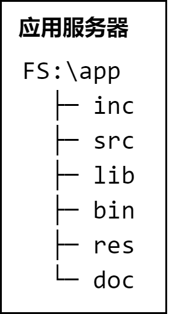
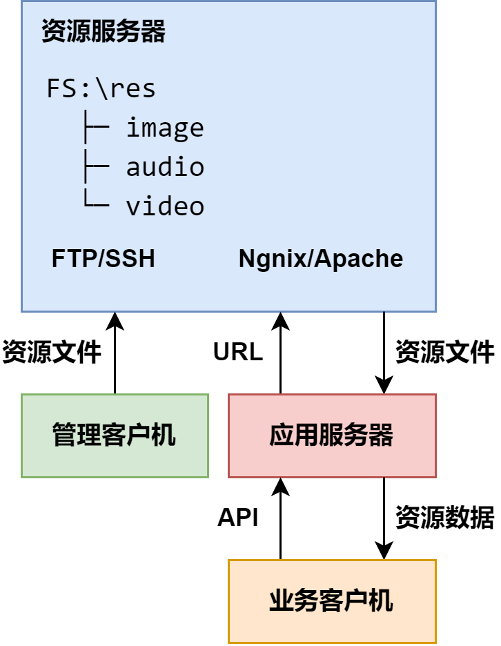
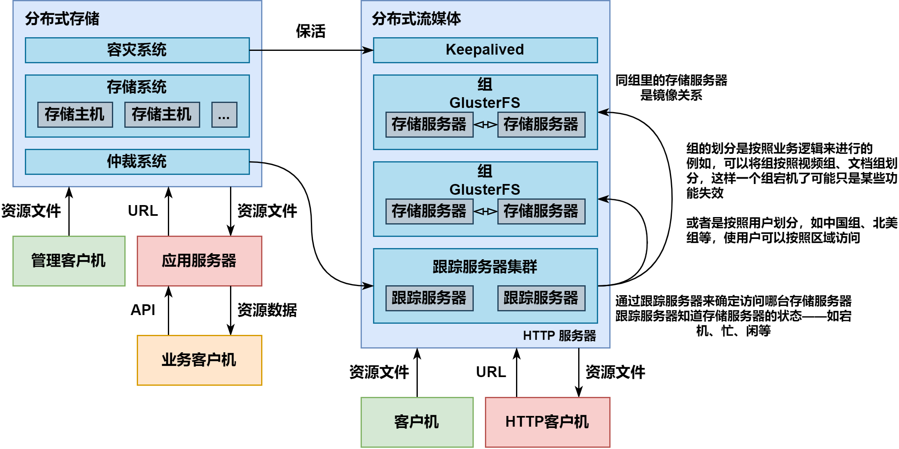

# Distributed_SM
A Distributed Streaming Media Project Used Cpp <p>
_使用 C++ 实现一个**分布式流媒体**项目_

---

## [🍔]基础知识补充

**[⚾]** **简单了解单机服务器开发的概念**
在同一台服务器上保存所有项目文件, 不同类型的文件存放在不同子目录下, 如下所示 : 





```
FS:\app
  ├─ inc
  ├─ src
  ├─ lib
  ├─ bin
  ├─ res
  └─ doc
```
- 包含 `inc` 目录下的头文件
- 编译 `src` 目录下的源文件
- 链接 `lib` 目录下的库文件
- 在 `bin` 目录下生成二进制可执行文件
- 在 `res` 目录下获取诸如图像、音频视频等, 不同类型的资源文件——通过运行可执行文件, 产生一到多个进程实例, 按照用户的需求获取
- 在 `doc` 目录存放与项目有关的文档
- **单机服务器开发的优缺点**
  - ***优点***
    - **实现简单 :** 在一台计算机上, 直接利用文件系统划分不同类型的文件
    - **访问方便 :** 无需借助任何复杂技术, 就能直接访问资源目录下的多媒体数据
  - ***缺点***
    - **不易管理 :** 源代码、可执行代码、第三方代码和资源媒体, 紧密耦合在同一台计算机的同一个文件系统中。文件越多, 分类越细, 目录结构越复杂, 文件存放越混乱
    - **性能不佳 :** 同时为多个客户机提供服务的多个进程或线程, 同时访问同一台计算机同一个文件系统中的资源文件, 会导致服务器整体性能下降, 延长响应时间, 影响用户体验 

**[⚾]** **简单了解独立服务器开发的概念** <p>
随着公司业务的不断发展, 将代码和资源放在同一台服务器上的弊端将日益凸显, 为此考虑引入独立的资源服务器专门负责存储和管理包括图像、音频、视频等在内的多媒体资源
- 通过 FTP 或 SSH 将资源文件上传到资源服务器的某个特定目录下
- 在资源服务器上布署 Ngnix 或 Apache, 以特定 URL 访问这些资源应用服务器
- 通过URL从资源服务器上下载资源文件, 为客户机提供服务
- **独立服务器开发的优缺点**
  - ***优点***
    - 对图像、音频、视频等多媒体资源的访问, 因其涉及到频繁的系统上下文切换和大量的磁盘 I/O 操作, 通常都会十分消耗系统资源。将其分离出来, 运行在**独立的资源服务器**上, 势必极大地减轻**应用服务器**的压力, 使之更加专注于发挥面向业务逻辑的动态处理效能
    - 将有关数据存储的工作, 交由独立的资源服务器专门负责, 便于对数据进行扩容、容灾以及迁移
    - 独立的资源服务器可以借助于负载均衡、数据缓存等技术手段, 进一步提高对资源的访问效率, 同时为日后迁移到 CDN 做好准备
  - ***缺点***
    - 只靠一台资源服务器容易形成性能瓶颈，其容灾和垂直扩展性也稍差

**[⚾]** **简单了解分布式存储开发的概念** <p>
随着业务的持续发展, 对应用系统的高响应性和高可用性的要求会越来越高。为了解决单台资源服务器性能有限、容灾和垂直扩展性差等问题, 考虑引入分布式存储
- 容灾系统 : 相互备份和热切换
- 存储系统 : 实际存储文件内容
- 仲裁系统 : 由算法确定文件存储位置
- **分布式存储开发的优缺点**
  - ***优点***
    - 高响应性 : 通过在多台存储主机间均衡负载, 消除了由单台资源服务器形成的性能瓶颈, 缩短了对应用服务器的响应时间
    - 高可用性 : 多台存储主机互为备份, 任何一台主机出现故障, 都不至影响整个系统的平稳运行
    - 高扩展性 : 可根据业务需要, 灵活增减存储主机的数量, 无需中断系统运行
  - ***缺点***
    - 系统复杂度稍高, 需要更多的服务器

**[⭐]** **分布式流媒体** <p>


将**分布式存储技术**应用于**流媒体服务业务**即分布式流媒体
- **Keepalived :** 在多台存储服务器和多台跟踪服务器之间实现热切换
- **组 :** 内容对等的存储服务器集合, 其文件系统通过 **GlusterFS** 实时同步
- **存储服务器 :** 实际存储流媒体文件的服务器, 同组存储服务器互为备份
- **跟踪服务器集群 :** 由多台跟踪服务器组成的集群, 互为热备份，负载均衡

---
# 项目总体架构


