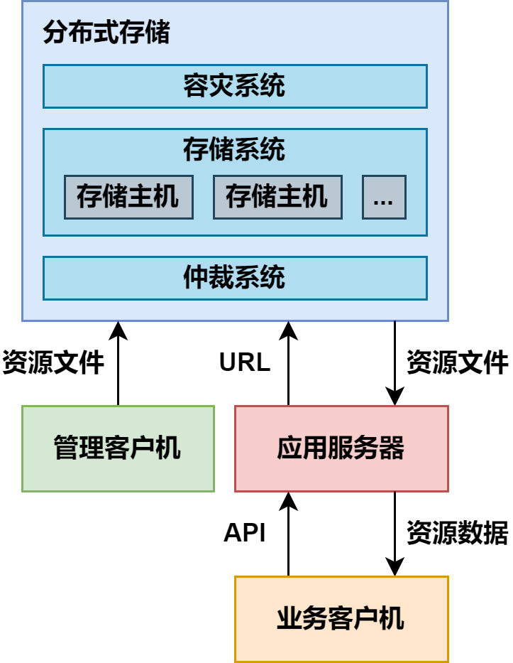
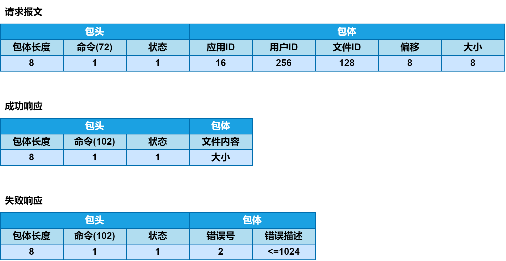

# Distributed_SM

A Distributed Streaming Media Project Used Cpp <p>
_使用 C++ 实现一个**分布式流媒体**项目_

---

## [更新日志]

- [x] 2023-12-04 创建 **Distributed_SM** 项目
- [x] 2024-01-16 完成期末考试任务，重新开始更新 **Distributed_SM** 项目，因为期末考试的原因，GitHub已经一个月没有碰了，重新捡起来

## [🍔]基础知识补充

**[⚾]** **简单了解单机服务器开发的概念**
在同一台服务器上保存所有项目文件，不同类型的文件存放在不同子目录下，如下所示 :

  

```
FS:\app
  ├─ inc
  ├─ src
  ├─ lib
  ├─ bin
  ├─ res
  └─ doc
```

- 包含 `inc` 目录下的头文件
- 编译 `src` 目录下的源文件
- 链接 `lib` 目录下的库文件
- 在 `bin` 目录下生成二进制可执行文件
- 在 `res` 目录下获取诸如图像、音频视频等，不同类型的资源文件——通过运行可执行文件，产生一到多个进程实例，按照用户的需求获取
- 在 `doc` 目录存放与项目有关的文档
- **单机服务器开发的优缺点**
  - ***优点***
    - **实现简单 :** 在一台计算机上，直接利用文件系统划分不同类型的文件
    - **访问方便 :** 无需借助任何复杂技术，就能直接访问资源目录下的多媒体数据
  - ***缺点***
    - **不易管理 :** 源代码、可执行代码、第三方代码和资源媒体，紧密耦合在同一台计算机的同一个文件系统中。文件越多，分类越细，目录结构越复杂，文件存放越混乱
    - **性能不佳 :** 同时为多个客户机提供服务的多个进程或线程，同时访问同一台计算机同一个文件系统中的资源文件，会导致服务器整体性能下降，延长响应时间，影响用户体验

**[⚾]** **简单了解独立服务器开发的概念** <p>
随着公司业务的不断发展，将代码和资源放在同一台服务器上的弊端将日益凸显，为此考虑引入独立的资源服务器专门负责存储和管理包括图像、音频、视频等在内的多媒体资源

- 通过 FTP 或 SSH 将资源文件上传到资源服务器的某个特定目录下
- 在资源服务器上布署 Ngnix 或 Apache，以特定 URL 访问这些资源应用服务器
- 通过URL从资源服务器上下载资源文件，为客户机提供服务
- **独立服务器开发的优缺点**
  - ***优点***
    - 对图像、音频、视频等多媒体资源的访问，因其涉及到频繁的系统上下文切换和大量的磁盘 I/O 操作，通常都会十分消耗系统资源。将其分离出来，运行在**独立的资源服务器**上，势必极大地减轻**应用服务器**的压力，使之更加专注于发挥面向业务逻辑的动态处理效能
    - 将有关数据存储的工作，交由独立的资源服务器专门负责，便于对数据进行扩容、容灾以及迁移
    - 独立的资源服务器可以借助于负载均衡、数据缓存等技术手段，进一步提高对资源的访问效率，同时为日后迁移到 CDN 做好准备
  - ***缺点***
    - 只靠一台资源服务器容易形成性能瓶颈，其容灾和垂直扩展性也稍差

**[⚾]** **简单了解分布式存储开发的概念** <p>
随着业务的持续发展，对应用系统的高响应性和高可用性的要求会越来越高。为了解决单台资源服务器性能有限、容灾和垂直扩展性差等问题，考虑引入分布式存储

- 容灾系统 : 相互备份和热切换
- 存储系统 : 实际存储文件内容
- 仲裁系统 : 由算法确定文件存储位置
- **分布式存储开发的优缺点**
  - ***优点***
    - 高响应性 : 通过在多台存储主机间均衡负载，消除了由单台资源服务器形成的性能瓶颈，缩短了对应用服务器的响应时间
    - 高可用性 : 多台存储主机互为备份，任何一台主机出现故障，都不至影响整个系统的平稳运行
    - 高扩展性 : 可根据业务需要，灵活增减存储主机的数量，无需中断系统运行
  - ***缺点***
    - 系统复杂度稍高，需要更多的服务器

**[⭐]** **分布式流媒体** <p>


将**分布式存储技术**应用于**流媒体服务业务**即分布式流媒体

- **Keepalived :** 在多台存储服务器和多台跟踪服务器之间实现热切换
- **组 :** 内容对等的存储服务器集合，其文件系统通过 **GlusterFS** 实时同步
- **存储服务器 :** 实际存储流媒体文件的服务器，同组存储服务器互为备份
- **跟踪服务器集群 :** 由多台跟踪服务器组成的集群，互为热备份，负载均衡

---

# 项目开发流程

## [🍟]项目总体架构


**跟踪服务器**
- 系统中包括一到多台跟踪服务器，每台跟踪服务器均维护完全相同的数据结构，以实时跟踪系统中每台存储服务器的状态变化
- 每台存储服务器启动伊始即将自己的详细信息加入到每台跟踪服务器所维护的数据结构中，并在此后以一定的周期间隔向每台跟踪服务器发出心跳信息将自身的状态标记为活动
- 同时跟踪服务器也以一定的周期间隔检查其所维护的数据结构，将长期收不到心跳信息的存储服务器标记为离线

**存储服务器 和 ID服务器**

- 系统中包括一到多台存储服务器，它们被划分为若干组每个存储服务器组通过 GlusterFS 保证其所有组员文件系统的同步性每台存储服务器上的文件保存在特定的目录结构中，其存储路径根据取自ID服务器的唯一标识计算而得
- 每台存储服务器通过启动时的加入和周期性的心跳，保证其运行状态得以实时反映于每台跟踪服务器所维护的数据结构中

**客户机**
- 当某台客户机需要上传文件时
  - 会首先向任意一台跟踪服务器**索要可用存储服务器的地址列表**
  - 跟踪服务器根据客户机提交的用户 ID，通过查询数据库确定其所隶属的组，并从其所维护的数据结构中挑选出若干台该组当前处于活动状态的存储服务器，以地址列表的形式返回给客户机
  - 而后客户机便可从此地址列表中选择一台存储服务器，发起上传文件请求后者一方面根据取自 ID 服务器的唯一标识确定存储路径并保存客户机上传的文件内容数据，另一方面将客户机提交的文件 ID 和该文件存储路径的对应关系保存在数据库中，以备日后下载和删除
  - GlusterFS 将在稍后的时间里，把此文件同步到组内的其它存储服务器中

**HTTP 服务器和客户机**
- HTTP 服务器将客户机的下载功能包装在针对 HTTP 请求 GET 方法的处理中，直接将从存储服务器下载得到的文件内容数据以 HTTP 响应的形式回传给 HTTP 客户机
- 后者可以是简单的 wget 命令，得到完整的离线媒体文件，也可以是任何支持 HTTP 协议的流媒体播放器，以实现在线实时播放

## [📰]报文规约
### 跟踪服务器报文
1. **存储服务器向跟踪服务器请求加入** 

   

   

2. **存储服务器向跟踪服务器发送心跳**

   

3. **客户机从跟踪服务器获取存储服务器地址表**

   

4. **客户机从跟踪服务器获取组列表**

   
### ID 服务器报文
0. **存储服务器从ID服务器获取ID**

   

### 存储服务器报文
1. **客户机向存储服务器上传文件**

   

2. **客户机向存储服务器询问文件大小**

   

3. **客户机从存储服务器下载文件**

   

4. **客户机要求删除存储服务器上的文件**

   

## [🖊] 库表结构


### tnv_trackerdb —— 跟踪服务器数据库

**_t_groups_info_ 组信息表**

`t_groups_info`表中记录了全部可用的组名，在存储服务器的配置文件中指明该存储服务器所隶属的组，其名称必含在此表之中

|  id  | group_name |     create_time     |     update_time     |
| :--: | :--------: | :-----------------: | :-----------------: |
|  1   |  group001  | 2023-12-07 10:00:00 | 2023-12-07 10:00:00 |
| ...  |    ...     |         ...         |         ...         |

**_t_router_ 组路由表**

跟踪服务器在处理来自客户机的，获取存储服务器地址列表的请求时，先查询 `t_router` 表，根据用户ID (`userid`) 获取其对应的组名(`group_name`)，再于该组中查找处于活动状态的存储服务器

若`t_router`表中没有与该用户对应的组，则从`t_groups_info`表中获取全部组名，随机抽取一个，分配给该用户，并记入`t_router`表

|  id  |  appid  | userid | group_name |     create_time     |     update_time     |
| :--: | :-----: | :----: | :--------: | :-----------------: | :-----------------: |
|  1   | tnvideo | tnv001 |  group001  | 2023-12-07 10:00:00 | 2023-12-07 10:00:00 |
| ...  |   ...   |  ...   |    ...     |         ...         |         ...         |

### tnv_idsdb —— ID服务器数据库

**_t_id_gen_ ID 生成表**

|   id    | id_value |     create_time     |     update_time     |
| :-----: | :------: | :-----------------: | :-----------------: |
| ../data |   100    | 2023-12-07 10:00:00 | 2023-12-07 10:00:00 |
|   ...   |   ...    |         ...         |         ...         |

针对与每个键相对应的ID值，ID服务器采取**内存累加，数据库步进**的方式，兼顾**唯一性和效率**


例如步长为100，在**内存中的ID为0**时，**数据库存储值为100**，如果 ID 服务器分配到 ***4号ID*** 因为某种情况宕机，内存中的数据丢失，但是数据库表中存储了100，则 ID 服务器重启后只需要从数据库中存储的 ***100号ID*** 重新分配后面的ID，在 ***4号ID* 后的所有未分配的 ID *直接舍弃***

ID 服务器采用键(`id`)-值(`id_value`)对的形式管理保存在每个存储路径下的文件的ID号。该 ID 号将参与生成文件在存储路径下的各级子目录和文件名，如下：

`../data/000/000/000/1A2B3C4D_000`

其中`../data`可以指存储服务器的一块硬盘，`/000/000/000`是每三个数字是由 ID 转化的512进制（满512进1，即`./000/000/512→ ./000/001/000`）的数字（存储0~511），`1A2B3C4D`是一个时间戳，`_000`是一个文件编号（存储0~511），即最终可以存储 <u>512×512×512×512</u> 个文件

### tnv_storagedb——存储服务器数据库

***t_file_xx* 文件信息表**

|   id   |  appid  | userid | status |            file_path             | file_size |     create_time     |     update_time     |
| :----: | :-----: | :----: | :----: | :------------------------------: | :-------: | :-----------------: | :-----------------: |
| 786450 | tnvideo | tnv001 |   0    | ../data/000/000/000/1A2B3C4D_000 |   27114   | 2023-12-07 10:00:00 | 2023-12-07 10:00:00 |
|  ...   |   ...   |  ...   |  ...   |               ...                |    ...    |         ...         |         ...         |

- `t_file_xx`表记录了文件ID(`id`)和路径(`file_path`)及大小(`file_size`)的对应关系

- 此文件 ID 并非由 ID 服务器生成，而是由客户端提供的用于访问该文件的标识（即通过算法算出）

- 为了保证其唯一性，在算法中包含了用户ID、进程ID、线程ID、时间戳、计数值和随机量等信息

  

- 不同用户上传的文件会被记录在不同的表中，表名的最后几个字符(xx)，由用户ID的哈希值计算得到：`t_file_01`、`t_file_02` 和 `t_file_03`

## [🌄]开发环境


### 操作系统——Ubuntu

1. **查看系统版本 :** 可以使用 `cat /proc/version`、`uname -a`、` lsb_release -a`命令查看Ubuntu的版本信息

   ```bash
   nilera@nilera-virtual-machine:~$ cat /proc/version
   Linux version 6.2.0-36-generic(buildd@lcy02-amd64-050)(x86_64-linux-gnu-gcc-11(Ubuntu 11.4.0-1ubuntu1-22.04) 11.4.0, GNU ld (GNU Binutils for Ubuntu) 2.38)#37~22.04.1-Ubuntu SMP PREEMPT_DYNAMIC Mon Oct 9 15:34:04 UTC 2
   ```

   ```bash
   nilera@nilera-virtual-machine:~$ uname -a
   Linux nilera-virtual-machine 6.2.0-36-generic #37~22.04.1-Ubuntu SMP PREEMPT_DYNAMIC Mon 0ct 9 15:34:04 UTC 2 X86_64 X86_64 X86_64 GNU/Linux
   ```

   ```bash
   nilera@nilera-virtual-machine:~$ lsb_release -a
   LSB Version:    core-11.1.0ubuntu4-noarch:security-11.1.0ubuntu4-noarch
   Distributor ID: Ubuntu
   Description:    Ubuntu 22.04.2 LTS
   Release:        22.04
   Codename:       jammy
   ```

   ```bash
   # 执行 lsb_release -a 命令出现 No LSB modules are available 问题
   # 使用 sudo apt-get install lsb-core 命令
   sudo apt-get install lsb-core
   ```

2. **如果无法 SSH 需要装两个包，请配合博客以下博客食用：**

   **[解决Ubuntu下 SSH无法连接的问题](https://blog.csdn.net/qq_42130526/article/details/119972366)**

   **[在 Ubuntu 中配置 SSH 的完整指南 | Linux 中国 - 知乎 (zhihu.com)](https://zhuanlan.zhihu.com/p/577082732)**

   ```bash
   # 查看 ssh 服务的状态
   ps -e | grep ssh
   # 或者使用以下命令
   service ssh status
   ```

   ```bash
   # 安装必要的包
   sudo apt-get install openssh-client
   sudo apt-get install openssh-server
   # 或者使用这个命令
   # sudo apt-get install ssh
   ```

   ```bash
   # 启动 ssh
   service sshd start
   ```

   ```bash
   # 解除防火墙对ssh服务的限制
   # Ubuntu 带有 UFW(Uncomplicated Firewall)防火墙, 这是管理网络规则的 iptables 的一个接口
   # 如果启动了防火墙, 它可能会阻止你连接服务器
   # 想要配置 UFW 允许你的接入, 需要运行如下命令, 亲测最关键的就是下面这行命令
   sudo ufw allow ssh
   ```


### 存储系统

#### Tcl

- **Tcl**是一种类似 *Shell* 或 *Python* 的，带有编程特征的解释型脚本语言

- 本项目并不直接使用**Tcl**，但本项目利用**Redis**实现缓存，**Redis**需要**Tcl**

- 在项目目录下构建并安装**Tcl**

  ```bash
  nilera@nilera-virtual-machine:~$ cd SoftwarePackages
  nilera@nilera-virtual-machine:~/SoftwarePackages$ wget http://downloads.sourceforge.net/tcl/tcl8.6.1-src.tar.gz
  ```

  ```bash
  nilera@nilera-virtual-machine:~/SoftwarePackages$ tar xzvf tcl8.6.1-src.tar.gz -C ../Software/Tcl
  ```

  ```bash
  nilera@nilera-virtual-machine:~/Software/Tcl/tcl8.6.1/unix$ ./configure
  ```

  ```bash
  nilera@nilera-virtual-machine:~/Software/Tcl/tcl8.6.1/unix$ make
  nilera@nilera-virtual-machine:~/Software/Tcl/tcl8.6.1/unix$ sudo make install
  ```

#### Redis

- **Redis**是一种基于*键-值对结构*的，高性能内存数据库（也可以持久化到磁盘）

- 本项目利用**Redis**作为数据库缓存，以提高对数据访问（主要是读访问）的效率

- 在项目目录下构建并安装**Redis**

  **参考博客：**[Ubuntu 22.04 编译安装 Redis 7](https://blog.csdn.net/u010044182/article/details/131481655)
  
  **Redis官网：**[Redis](https://redis.io/)
  
  ```bash
  nilera@nilera-virtual-machine:~$ cd SoftwarePackages
  nilera@nilera-virtual-machine:~/SoftwarePackages$ wget https://github.com/redis/redis/archive/7.2.4.tar.gz
  ```

  ```bash
  nilera@nilera-virtual-machine:~/SoftwarePackages$ tar xzvf redis-7.2.4.tar.gz -C ../Software/Redis
  ```
  
  ```bash
  nilera@nilera-virtual-machine:~/Software/Redis/redis-7.2.4$ sudo apt install make gcc pkg-config
  nilera@nilera-virtual-machine:~/Software/Redis/redis-7.2.4$ make -j4	# -j 使用多线程编译
  nilera@nilera-virtual-machine:~/Software/Redis/redis-7.2.4$ make test
  
  # 最好的情况: All tests passed without errors!
  # 有些错误的话也是不影响的
  # 满屏错误就比较离谱了
  
  nilera@nilera-virtual-machine:~/Software/Redis/redis-7.2.4$ sudo make install
  ```

完成以上步骤后，Redis其实已经完成了安装，但是此时每次重启机器时，都需要手动启动Redis，因此需要将其制作为服务，方便我们的操作。上述过程如下：

- 修改内核参数

  ```bash
  nilera@nilera-virtual-machine:~/Software/Redis/redis-7.2.4$ sudo vi /etc/sysctl.conf
  
  nilera@nilera-virtual-machine:~/Software/Redis/redis-7.2.4$ sudo vi /etc/sysctl.conf
  nilera@nilera-virtual-machine:~/Software/Redis/redis-7.2.4$ sudo sysctl -p
  [sudo] password for nilera:
  vm.overcommit_memory = 1
  net.core.somaxconn = 511
  ```

  添加或修改配置：`vm.overcommit_memory=1`以及`net.core.somaxconn=511`，然后保存文件。

  使配置文件生效：`sudo sysctl -p`

- 复制并修改Redis配置文件

  ```bash
  nilera@nilera-virtual-machine:~/Software/Redis/redis-7.2.4$ sudo mkdir -p /etc/redis
  nilera@nilera-virtual-machine:~/Software/Redis/redis-7.2.4$ sudo mkdir -p /var/redis/6379
  nilera@nilera-virtual-machine:~/Software/Redis/redis-7.2.4$ sudo cp redis.conf /etc/redis/6379.conf
  nilera@nilera-virtual-machine:~/Software/Redis/redis-7.2.4$ sudo vi /etc/redis/6379.conf
  ```

  `6379`是Redis默认端口号，Redis可以在一台机器上产生多个实例，这些实例通过端口号进行区分。

  修改`daemonize yes`表示**开启精灵模式**，以及`dir /var/redis/6379`表示**指定持久化路径**。

- 将Redis配置为系统服务并启动

  ```bash
  nilera@nilera-virtual-machine:~/Software/Redis/redis-7.2.4$ sudo cp utils/redis_init_script /etc/init.d/redis_6379
  nilera@nilera-virtual-machine:~/Software/Redis/redis-7.2.4$ sudo vi /etc/init.d/redis_6379
  ### BEGIN INIT INFO
  # Provides:				redis_6379
  # Required-Start:		
  # Required-Stop:		
  # Default-Start:		2 3 4 5
  # Default-Stop:			0 1 6
  # Short-Description:	Redis data structure server
  # Description:			Redis data structure server. See https://redis.io
  ### END INIT INFO
  
  nilera@nilera-virtual-machine:~/Software/Redis/redis-7.2.4$ sudo update-rc.d redis_6379 defaults
  
  # 开启服务
  nilera@nilera-virtual-machine:~/Software/Redis/redis-7.2.4$ sudo /etc/init.d/redis_6379 start
  
  # 关闭服务
  nilera@nilera-virtual-machine:~/Software/Redis/redis-7.2.4$ sudo /etc/init.d/redis_6379 stop
  ```

  `init.d`是Linux用于启动后台服务的脚本的位置。

#### MySQL

- **MySQL**是一个关系型数据库管理系统，由瑞典**MySQLAB** 公司开发，属于**Oracle**旗下产品

- MySQL实行双授权政策，分为社区版和商业版，由于其体积小、速度快、拥有成本低且开放源代码，一般中小型应用系统多选择MySQL作为数据库

- 在系统中安装MySQL服务器、客户端及客户端开发库

  **参考博客：**[Ubuntu 22.04 安装 MySQL5.7.42 - CSDN博客](https://blog.csdn.net/gd911202/article/details/128662691)

  **MySQL：**[Download MySQL Community Server (Archived Versions)](https://downloads.mysql.com/archives/community/)

  ```bash
  # 更新依赖源及安装libaio1以及libtinfo5的依赖
  nilera@nilera-virtual-machine:~/SoftwarePackages$ tar -xvf ./mysql-server_5.7.42-1ubuntu18.04_amd64.deb-bundle.tar -C ../Software/MySQL
  ```

  ```bash
  # 按下列顺序安装（提示缺少依赖可更换顺序）
  nilera@nilera-virtual-machine:~/Software/MySQL$ sudo dpkg -i mysql-common_5.7.42-1ubuntu18.04_amd64.deb
  nilera@nilera-virtual-machine:~/Software/MySQL$ sudo dpkg-preconfigure mysql-community-server_5.7.42-1ubuntu18.04_amd64.deb # 此步需要输入数据库的root用户的密码
  nilera@nilera-virtual-machine:~/Software/MySQL$ sudo dpkg -i libmysqlclient20_5.7.42-1ubuntu18.04_amd64.deb
  nilera@nilera-virtual-machine:~/Software/MySQL$ sudo dpkg -i libmysqlclient-dev_5.7.42-1ubuntu18.04_amd64.deb
  nilera@nilera-virtual-machine:~/Software/MySQL$ sudo dpkg -i libmysqld-dev_5.7.42-1ubuntu18.04_amd64.deb
  nilera@nilera-virtual-machine:~/Software/MySQL$ sudo dpkg -i mysql-community-client_5.7.42-1ubuntu18.04_amd64.deb
  nilera@nilera-virtual-machine:~/Software/MySQL$ sudo dpkg -i mysql-client_5.7.42-1ubuntu18.04_amd64.deb
  nilera@nilera-virtual-machine:~/Software/MySQL$ sudo dpkg -i mysql-common_5.7.42-1ubuntu18.04_amd64.deb
  ```

  ```bash
  # 继续安装依赖
  nilera@nilera-virtual-machine:~/Software/MySQL$ sudo apt-get -f install
  nilera@nilera-virtual-machine:~/Software/MySQL$ sudo apt-get -f install libmecab2
  ```

  ```bash
  # 安装 mysql-server
  nilera@nilera-virtual-machine:~/Software/MySQL$ sudo dpkg -i mysql-community-server_5.7.42-1ubuntu18.04_amd64.deb
  nilera@nilera-virtual-machine:~/Software/MySQL$ sudo dpkg -i mysql-server_5.7.42-1ubuntu18.04_amd64.deb
  ```

  ```bash
  # 验证安装
  nilera@nilera-virtual-machine:~/Software/MySQL$ mysql -u root -p
  ```

### 网络框架

#### ACL

- ACL工程是一个跨平台的网络通信库及服务器编程框架，同时提供更多的实用功能库

  - 如Linux、Windows、Solaris、MacOS、FreeBSD

- 通过该库，用户可以非常容易地编写支持多种模式的服务器程序，WEB应用程序，数据库应用程序

  - 多线程、多进程、非阻塞、触发器、UDP方式、协程方式

- ACL提供常用客户端通信库

  - HTTP、SMTP、ICMP、Redis、Memcache、Beanstalk、Handler Socket

- ACL提供常用流式编解码库

  - XML、JSON、MIME、BASE64、UUCODE、QPCODE、RFC2047

- ACL的作者是郑树新（微博: http://weibo.com/zsxxsz）

- 在项目目录下构建并安装ACL

  **ACL 项目地址：**[ACL](https://github.com/acl-dev/)

  ```bash
  # 首先在 GitHub 下载 ACL
  # 然后使用 unzip 命令解压
  nilera@nilera-virtual-machine:~/Software/ACL$ unzip ../../SoftwarePackages/acl-master.zip -d ./
  
  # 在执行 make 指令之前需要安装 zlib 库, 使用下列命令安装
  nilera@nilera-virtual-machine:~$ sudo apt-get install libz-dev
  
  nilera@nilera-virtual-machine:~/Software/ACL$ cd acl-master/
  nilera@nilera-virtual-machine:~/Software/ACL/acl-master$ make
  nilera@nilera-virtual-machine:~/Software/ACL/acl-master$ sudo make install
  
  begin copy file...
  cp -f app/master/daemon/acl_master ./dist/master/libexec/linux64/
  cp -f libacl_all.a ./dist/lib/linux64/
  cp -f lib_acl/lib/libacl.a ./dist/lib/linux64/
  cp -f lib_acl_cpp/lib/libacl_cpp.a ./dist/lib/linux64/
  cp -f lib_protocol/lib/libprotocol.a ./dist/lib/linux64/
  cp -Rf lib_acl/include/* ./dist/include/acl/
  cp -Rf lib_protocol/include/* ./dist/include/protocol/
  cp -Rf lib_acl_cpp/include/acl_cpp/* ./dist/include/acl_cpp/
  
  # 将库文件复制到 /usr/include/acl-lib 下
  nilera@nilera-virtual-machine:~/Software/ACL/acl-master$ sudo mkdir -p /usr/include/acl-lib
  nilera@nilera-virtual-machine:~/Software/ACL/acl-master$ sudo cp -rf ./dist/include/* /usr/include/acl-lib/
  nilera@nilera-virtual-machine:~/Software/ACL/acl-master$ sudo cp -rf ./dist/lib/linux64/* /usr/lib
  ```

### 媒体框架

#### VCL

- VLC是一款免费、开源的跨平台多媒体播放器及框架，可播放大多数多媒体文件，以及DVD、音频CD、VCD及各类流媒体协议

- **libVLC**是**VLC**所依赖的多媒体框架核心引擎及编程接口库，基于该库可以很容易地开发出与VLC具有相同功能集的多媒体应用

- 在系统中安装**VLC**和**libVLC**
  ```bash
  nilera@nilera-virtual-machine:~/Software/ACL/acl-master$ sudo apt-get install vlc libvlc-dev
  ```

  
